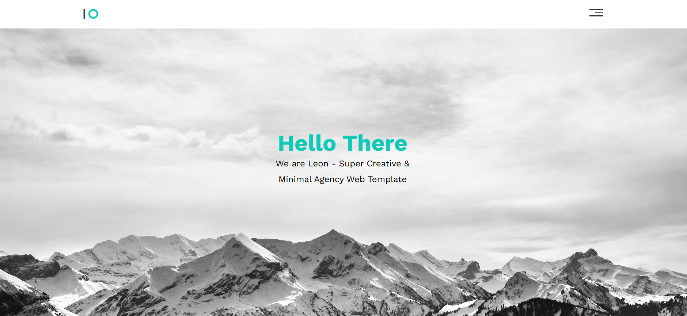

# leon-template
A modern responsive landing page built using HTML and CSS. This project is part of Elzero Web School training, focused on practicing clean UI design, layout structuring, and responsive front-end development.
# Leon Template

## 📌 Overview
This is a modern and responsive landing page built using HTML and CSS.  
It is part of Elzero Web School training projects aimed at improving front-end development skills and mastering layout design.

---

## ✨ Features
- Fully responsive design
- Clean and minimal UI
- Modern landing page structure
- Built using HTML5 & CSS3
- Organized and reusable code

---

## 🛠️ Technologies Used
- HTML
- CSS
- Font Awesome

---

## 📷 Preview

---

## 🚀 Live Demo
(https://mahmoudkourd2004-prog.github.io/leon-template/)

---

## 📁 How to Use
1. Clone the repository
2. Open `index.html` in your browser
3. Explore the design

---

## 🎯 Purpose
This project was built for learning purposes as part of Elzero Web School training to practice real-world front-end skills.

---

## 👨‍💻 Author
Mahmoud Elkourd
